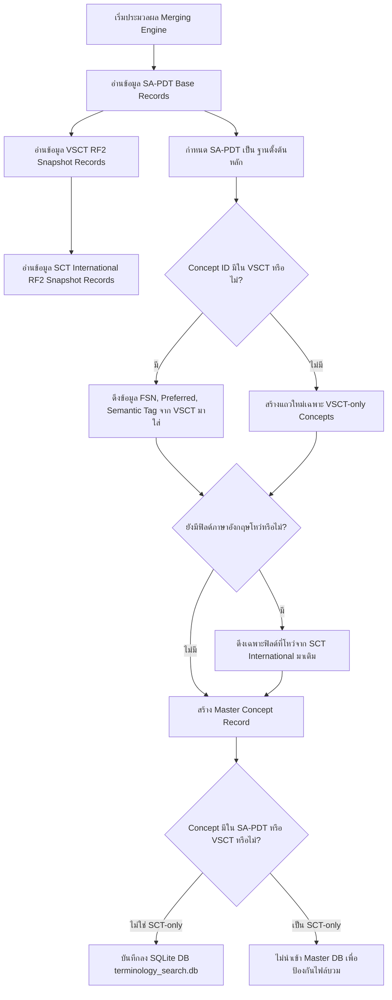
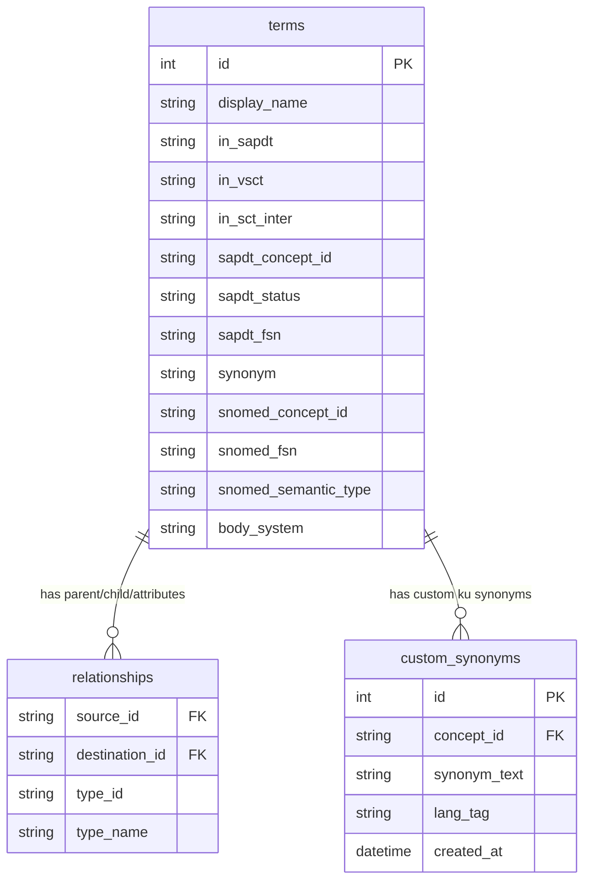
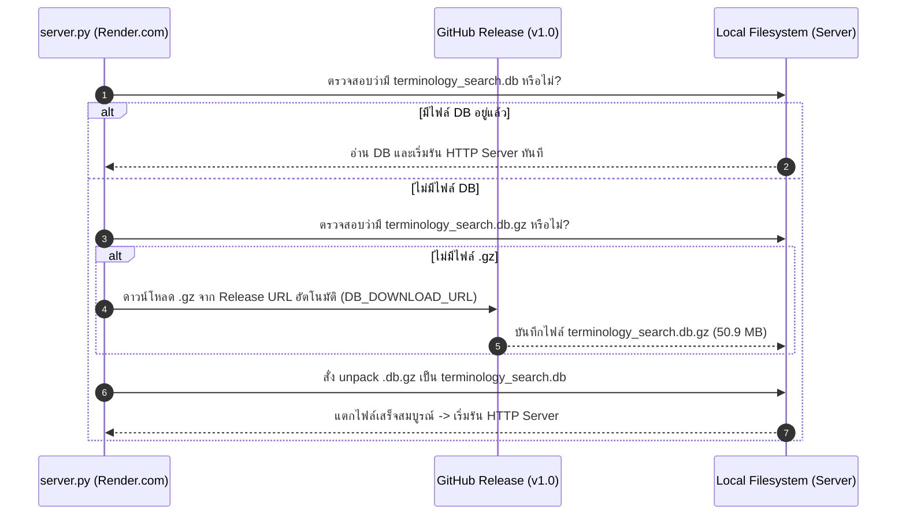
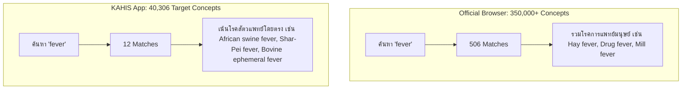
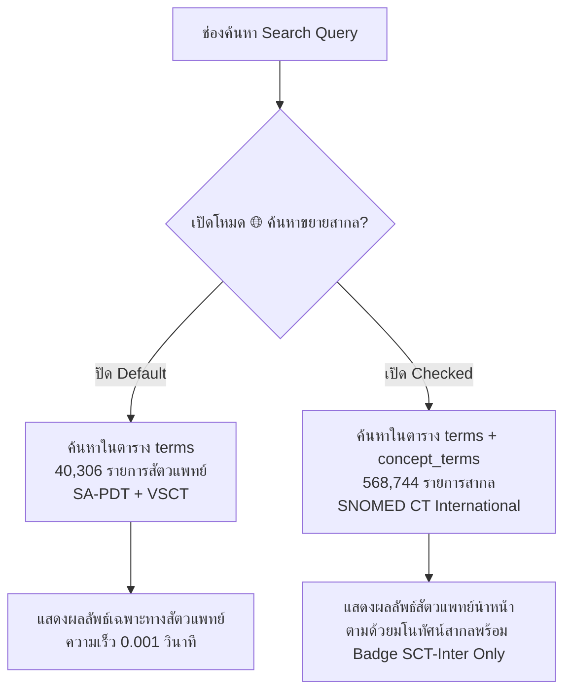

# KAHIS Terminology System - Logic, Architecture & Operational Specification (SOP / WI / Dev Handover)

> **เอกสารข้อกำหนดสถาปัตยกรรม Logic และคู่มือการปฏิบัติงานมาตรฐาน (SOP / WI)**
> สำหรับระบบบริหารจัดการและค้นหาข้อมูลคำศัพท์สัตวแพทย์ **KAHIS (SA-PDT & SNOMED CT Veterinary Extension)**
> **เวอร์ชันเอกสาร**: 4.5.0 | **วันอัปเดต**: 2026-07-21 | **สถานะ**: อนุมัติสเปก (Pending Execution Approval)

---

## 1. วัตถุประสงค์และขอบเขตของเอกสาร (Purpose & Scope)

เอกสารฉบับนี้จัดทำขึ้นเพื่อใช้เป็น **ข้อกำหนดสถาปัตยกรรมระบบ (Technical Architecture Specification)**, **คู่มือการปฏิบัติงานมาตรฐาน (Standard Operating Procedure - SOP)**, **คู่มือการทำงาน (Work Instruction - WI)** และ **เอกสารส่งต่อทีมพัฒนา (Developer Handover Specification)** สำหรับระบบ KAHIS Terminology โดยครอบคลุม:

1. **สถาปัตยกรรมไฟล์และโครงสร้างไดเรกทอรี** ที่ปราศจากข้อผูกมัดชื่อโฟลเดอร์ราก (Relative Paths)
2. **ระบบบริหารจัดการหลังบ้าน (Admin Control Panel)** พร้อมการยืนยันรหัส PIN สิทธิ์การใช้งาน
3. **อัลกอริทึมการรวมข้อมูลจาก 3 แหล่ง (Merging Engine)** ตามลำดับความสำคัญ `SA-PDT` > `VSCT` > `SCT International`
4. **การแก้ไข Bug ทางเทคนิคทั้งหมด** รวมถึงรหัสสายสัมพันธ์ `IS_A_TYPE = '116680003'`
5. **โครงสร้างฐานข้อมูล SQLite (`terminology_search.db`)** ทั้ง 4 ตารางหลัก
6. **ระบบคำพ้องประจำโครงการ (`ku` Custom Synonyms)** พร้อมระบบส่งออกไฟล์ `ku_custom_synonyms.csv` เฉพาะ และนโยบายป้องกันข้อมูลสูญหายเมื่ออัปเดต Release
7. **นโยบายการจัดเก็บและการแสดงผลสถานะ Active / Inactive**
8. **หมวดคำถาม-คำตอบที่พบบ่อย (Frequently Asked Questions - FAQ)** รวบรวมจากข้อซักถามทั้งหมด

---

## 2. กฎเหล็กและการจัดโครงสร้างไดเรกทอรี (Directory Architecture & Rules)

### 🛑 กฎเหล็กการจัดการไฟล์ต้นฉบับ (Raw Files Read-Only Policy)
1. **ห้ามแก้ไข ดัดแปลง หรือเขียนทับไฟล์ข้อมูลต้นฉบับในโฟลเดอร์แหล่งข้อมูลทุกไฟล์โดยเด็ดขาด**
2. ไฟล์ข้อมูลต้นฉบับทั้งหมด (`SA-PDT`, `VSCT`, `SCT International`) ถูกกำหนดสิทธิ์เป็น **Read-Only**
3. การปรับแต่ง การเพิ่มคำพ้อง หรือคำแปลภาษาไทยเพิ่มเติมทั้งหมด จะต้องดำเนินการผ่าน **ระบบตารางเสริม (`custom_synonyms`)** ในฐานข้อมูลเท่านั้น

### 📁 โครงสร้างโปรเจกต์ (Directory Layout Specification)

```text
<project-root>/                           <-- โฟลเดอร์ราก (สามารถเปลี่ยนชื่อเป็นชื่อใดก็ได้โดยไม่มีผลกระทบ)
└── kahis-terminology/
    ├── kahis-terminology-app/           <-- [1] Web Application & App Server
    │   ├── server.py                     <-- HTTP Server & REST API Handlers
    │   ├── static/                       <-- HTML5, Vanilla CSS3, JS Frontend
    │   │   ├── index.html                <-- หน้าแรกสำหรับค้นหาสำหรับสัตวแพทย์ (User App)
    │   │   ├── admin.html                <-- หน้าบริหารจัดการระบบหลังบ้าน (Admin UI)
    │   │   ├── style.css                 <-- Stylesheet
    │   │   └── app.js                    <-- Client Controllers & SVG Diagram Engine
    │   ├── build_direct_db.py            <-- สคริปต์ประมวลผลสร้าง SQLite DB จาก 3 แหล่ง
    │   ├── terminology_search.db         <-- ฐานข้อมูล SQLite หลักเพียงไฟล์เดียว (1 DB File)
    │   ├── start.sh                      <-- สคริปต์เปิดแอปพลิเคชันค้นหาและรันเซิร์ฟเวอร์
    │   └── stop.sh                       <-- สคริปต์ยุติการทำงานของเซิร์ฟเวอร์
    ├── terminology-builder-app/         <-- [2] Local Builder Web App จากต้นฉบับ
    ├── SA-PDT-Terminology-03-31-2026/   <-- [Source 1] โฟลเดอร์ต้นฉบับ SA-PDT
    ├── SnomedCT_VETExtension_.../       <-- [Source 2] โฟลเดอร์ต้นฉบับ VSCT (RF2 Snapshot)
    ├── SnomedCT_InternationalRF2_.../   <-- [Source 3] โฟลเดอร์ต้นฉบับ SCT Inter (RF2 Snapshot)
    └── output/                          <-- [Target] โฟลเดอร์ส่งออก master_kahis_terminology.csv และ ku_custom_synonyms.csv
```

---

## 3. ระบบบริหารจัดการหลังบ้านและระบบความปลอดภัย (Admin Control Panel & Security)

### 🔐 3.1 การควบคุมสิทธิ์เข้าถึง (PIN Authentication)
* **URL เข้าใช้งาน**: `http://localhost:8080/admin.html` (หรือเข้าผ่านปุ่ม ⚙️ ฝั่งซ้ายของแถบหัวเรื่องการค้นหา)
* **รหัส PIN ความปลอดภัย**: **`53******`**
* **กลไกความปลอดภัย**: เมื่อเปิดเข้าหน้า `admin.html` ระบบจะแสดง Modal ล็อคหน้าจอ หากผู้ใช้งานไม่ป้อนรหัส PIN หรือป้อนรหัสไม่ถูกต้อง ระบบจะไม่อนุญาตให้กดสั่งรัน Rebuild DB หรือสั่ง Export ใดๆ

### 🔍 3.2 ระบบตรวจจับเวอร์ชันแหล่งข้อมูลอัตโนมัติ (Auto-Release Detection)
เมื่อเปิดหน้า Admin ระบบ Python จะใช้ Pattern Matching สแกนโฟลเดอร์ในโปรเจกต์อัตโนมัติ:
* **SA-PDT**: ค้นหาโฟลเดอร์ที่มีคำว่า `SA-PDT` ➔ อ่านวันที่จากชื่อไฟล์ `SA-PDTReleaseFile_full_YYYYMMDD.txt`
* **VSCT**: ค้นหาโฟลเดอร์ที่มีคำว่า `VETExtension` ➔ อ่านวันที่จากชื่อโฟลเดอร์ `INT1000009_YYYYMMDD`
* **SCT International**: ค้นหาโฟลเดอร์ที่มีคำว่า `InternationalRF2` ➔ อ่านวันที่จากชื่อโฟลเดอร์ `PRODUCTION_YYYYMMDD`

### 🛠️ 3.3 คำสั่งหลังบ้านในหน้า Admin UI (3 หลักคำสั่ง)
1. **ปุ่ม `[🔨 1. สร้าง/ประมวลผล ฐานข้อมูล (Rebuild DB)]`**:
   * สั่งรันสคริปต์ประมวลผลอ่านไฟล์จาก 3 โฟลเดอร์ต้นฉบับเพื่อสร้างไฟล์ `terminology_search.db` ใหม่ทันที (ใช้เวลา 10-15 วินาที)
2. **ปุ่ม `[📥 2. ส่งออกไฟล์ master_kahis_terminology.csv]`**:
   * แปลงข้อมูล Master ใน SQLite DB ออกเป็นไฟล์ `master_kahis_terminology.csv` (30 คอลัมน์) ไปเก็บไว้ที่โฟลเดอร์ `output/` เพื่อนำไปทดสอบเปรียบเทียบกับ Master CSV 30 คอลัมน์เดิม
3. **ปุ่ม `[📥 3. ส่งออกไฟล์ ku_custom_synonyms.csv]` (ฟังก์ชั่นใหม่ 🌟)**:
   * ดึงเฉพาะข้อมูลคำพ้องประจำโครงการ (แท็ก `ku`) ออกมาเป็นไฟล์ `output/ku_custom_synonyms.csv` เพื่อให้นำไปตรวจสอบ ทบทวน หรือสำรองข้อมูล (Backup) ได้อย่างสะดวกรวดเร็ว
4. **ปุ่ม `[🚀 4. เปิดหน้าแอปพลิเคชันค้นหา (Launch User App)]`**:
   * สลับหน้าจอไปยังหน้าสืบค้นหลักสำหรับสัตวแพทย์ (`index.html`)

---

## 4. อัลกอริทึมการรวมข้อมูลจาก 3 แหล่งข้อมูล (3-Source Merging Engine Specification)

### ⚙️ 4.1 ลำดับความสำคัญของข้อมูล (Field-Level Source Priority Rules)


1. **SA-PDT (Base Source)**: เป็นฐานตั้งต้นในการสร้างรายการคำศัพท์ 
2. **VSCT (Primary Enrichment Source)**: เป็นชุดข้อมูลสัตวแพทย์ส่วนขยายหลัก หาก Concept ID ใดมีใน VSCT ให้ดึงคำศัพท์ (`snomed_fsn`, `snomed_preferred_term`, `snomed_semantic_type`, `body_system`) จาก VSCT มาเติมเป็นอันดับแรก
3. **SCT International (Fallback Source Only)**: ใช้เติมเต็มเฉพาะคอลัมน์ภาษาอังกฤษที่ยังคงว่างอยู่เท่านั้น **หากเป็น Concept ID ที่มีเฉพาะใน SCT International อย่างเดียว (ไม่มีทั้งใน SA-PDT และ VSCT) จะไม่ถูกนำเข้ามาใน Master DB**
4. **ข้อกำหนดไฟล์ Snapshot**: ต้องเลือกใช้ไฟล์ชุด `Snapshot` เท่านั้น (เช่น `sct2_Description_Snapshot-en...`) ห้ามใช้ชุด `Full` เพื่อป้องกันข้อมูลประวัติซ้ำซ้อนและข้อมูลยกเลิกตกค้าง

### 🐛 4.2 การแก้ไข Bug ทางเทคนิคทั้งหมด (Bug Fixes Summary)
* **แก้ไข Bug IS-A Relationship**: แก้ไขรหัสจาก `116680008` (ผิด) เป็น **`116680003` (ถูกต้อง)** 
  * จากการตรวจสอบไฟล์จริง `sct2_Relationship_Snapshot_INT1000009_20260331.txt` พบว่ามีแถว `typeId = '116680003'` จำนวน **47,446 แถว** (และมี `116680008` จำนวน 0 แถว) การแก้ไขนี้ทำให้สายสัมพันธ์ Parents/Children ดึงออกมาได้ครบถ้วน 100%
* **แก้ไขปัญหาเบราว์เซอร์ค้าง/แรมเต็ม**: เปลี่ยนกระบวนการประมวลผลจากการรันใน JS เบราว์เซอร์มาเป็น **Python Line Streaming** ประมวลผลเสร็จใน **10-15 วินาที** บนเครื่องคอมพิวเตอร์ทั่วไป

---

## 5. โครงสร้างฐานข้อมูล SQLite (`terminology_search.db` Schema Specification)

ฐานข้อมูล SQLite เดียวนี้ประกอบด้วย **4 ตารางหลัก** ดังนี้:



### 5.1 ตาราง `terms` (ตาราง Master 103,967 รายการ)
* **`id`** (INTEGER, PK): รหัสแถวหลัก
* **`display_name`** (TEXT): ชื่อศัพท์หลักสำหรับแสดงผลในตารางฝั่งซ้าย
* **`in_sapdt`**, **`in_vsct`**, **`in_sct_inter`** (TEXT): ธงระบุที่มา (`Yes`/`No`)
* **`sapdt_concept_id`**, **`sapdt_status`**, **`sapdt_fsn`**, **`sapdt_preferred`**, **`sapdt_acceptable`** (TEXT): ข้อมูลชุด SA-PDT
* **`synonym`** (TEXT): รวมคำพ้องทั้งหมดสำหรับใช้ค้นหา (คั่นด้วย `|`)
* **`snomed_concept_id`**, **`snomed_fsn`**, **`snomed_preferred_term`**, **`snomed_semantic_type`**, **`snomed_active`** (TEXT): ข้อมูลชุด SNOMED CT / VSCT
* **`body_system`** (TEXT): ระบบอวัยวะร่างกายที่คำนวณจากสายสัมพันธ์จริง

### 5.2 ตาราง `relationships` (ตารางสายสัมพันธ์โครงสร้างต้นไม้)
* **`source_id`** (TEXT): รหัส Concept ต้นทาง (Child Concept ID)
* **`destination_id`** (TEXT): รหัส Concept ปลายทาง (Parent Concept ID หรือ Attribute Value)
* **`type_id`** (TEXT): รหัสสายสัมพันธ์ (`116680003` = IS-A Parent, `363698007` = Finding site)
* **`type_name`** (TEXT): ชื่อสายสัมพันธ์ภาษาอังกฤษ เช่น `Is a`, `Finding site`, `Pathological process`

### 5.3 ตาราง `concept_terms` (ตารางดรรชนีสืบค้นเสริม)
* **`concept_id`** (TEXT): รหัส Concept ID
* **`term`** (TEXT): ชื่อศัพท์
* **`semantic_type`** (TEXT): หมวดหมู่ประเภทมโนทัศน์

### 5.4 ตาราง `custom_synonyms` (ตารางคำพ้องประจำโครงการ `ku`) 🌟
* **`id`** (INTEGER, PK): รหัสแถวการบันทึก
* **`concept_id`** (TEXT): รหัส Concept ID ที่เพิ่มคำพ้อง
* **`synonym_text`** (TEXT): คำพ้องภาษาไทยหรือภาษาอังกฤษที่เพิ่มใหม่
* **`lang_tag`** (TEXT): กำหนดค่าเป็น **`ku`** สำหรับคำพ้องประจำโครงการ
* **`created_at`** (DATETIME): วันเวลาที่บันทึกข้อมูล

---

## 6. ระบบคำพ้องประจำโครงการ (`ku` Custom Synonyms Specification)

### 🏷️ 6.1 การแสดงผลบนกล่องสีฟ้า (Main Concept Card)
ในหน้า Concept Details (ฝั่งขวา) บริเวณหัวข้อ **`Synonyms & Aliases:`** รายการคำพ้องจะแสดงสัญลักษณ์แยกที่มาดังนี้:
```text
Synonyms & Aliases:
• en   Urinary bladder stone
• en   Bladder calculus
• en   Urolithiasis of bladder
• ku   cystic calculi           <-- แสดงแท็ก ku ชัดเจน
• ku   นิ่วในกระเพาะปัสสาวะ     <-- แสดงแท็ก ku ชัดเจน
```

### ➕ 6.2 หน้าต่าง Modal เพิ่มคำพ้อง (Add Synonym UI Modal)
* บริเวณหัวข้อ `Synonyms & Aliases:` เพิ่มปุ่ม **`[+ เพิ่มคำพ้อง / Add Synonym]`**
* เมื่อกดปุ่ม หน้าต่าง Modal จะเด้งขึ้นมาให้ป้อนคำพ้อง โดยสามารถพิมพ์หลายคำได้โดยใช้เครื่องหมายจุลภาค (`,`) คั่น เช่น: `cystic calculi, นิ่วในกระเพาะปัสสาวะ`
* เมื่อกด **[บันทึก / Save]**:
  * ระบบจะ INSERT ข้อมูลลงตาราง `custom_synonyms` และนำคำพ้องไปต่อท้ายคอลัมน์ `synonym` ในตาราง `terms`
  * **จำนวนแถวในตาราง `terms` ไม่เพิ่มขึ้นเลยแม้แต่แถวเดียว (1 Concept = 1 Row)**
  * หน้ากล่องสีฟ้าอัปเดตแสดงแท็ก `ku` ทันทีโดยไม่ต้องรีโหลดหน้าเว็บ

### 📥 6.3 ระบบส่งออกไฟล์คำพ้องประจำโครงการเฉพาะ (`ku_custom_synonyms.csv`) 🌟
ในหน้า Admin Control Panel (`admin.html`) เพิ่มฟังก์ชันสำหรับส่งออกเฉพาะไฟล์คำพ้องประจำโครงการ:
* **ไฟล์ผลลัพธ์**: `output/ku_custom_synonyms.csv`
* **โครงสร้างคอลัมน์ใน CSV**:
  ```csv
  concept_id,display_name,synonym_text,lang_tag,created_at
  70650003,Bladder stone,cystic calculi,ku,2026-07-21 10:45:00
  70650003,Bladder stone,นิ่วในกระเพาะปัสสาวะ,ku,2026-07-21 10:45:00
  ```
* **ประโยชน์**: ช่วยให้สัตวแพทย์และผู้ดูแลระบบสามารถส่งออกเฉพาะรายการคำพ้องที่ทีมงานเพิ่มขึ้นเอง มาตรวจสอบ ทบทวน แก้ไข หรือสำรองข้อมูล (Backup) ได้อย่างง่ายดายโดยไม่ต้องเปิดไฟล์ Master CSV ขนาดใหญ่

### 🛡️ 6.4 นโยบายป้องกันข้อมูล `ku` สูญหายเมื่ออัปเดต Release ใหม่ (Custom Migration Policy)
* เมื่อมี Release ใหม่ของ VSCT/SCT Inter เข้ามา และมีบาง Concept ID ถูกเปลี่ยนรหัส (Replaced BY)
* สคริปต์ Rebuild DB จะอ่านไฟล์ `der2_cRefset_AssociationSnapshot` เพื่อตรวจจับรหัสทดแทน
* หากพบว่ารหัสเดิมถูกเปลี่ยนเป็นรหัสใหม่ ระบบจะ **ย้ายและเชื่อมโยงคำพ้องแท็ก `ku` ตามไปยังรหัสใหม่ให้อัตโนมัติ** พร้อมแสดงรายงานสรุปในหน้า Admin Console

---

## 7. นโยบายการจัดการข้อมูล Active / Inactive และการแสดงผล Children

### ⚖️ 7.1 นโยบายการจัดเก็บและการสืบค้น (Search Policy)
1. **ระดับฐานข้อมูล (Database Level)**: จัดเก็บทั้งรายการ Active และ Inactive ไว้ทั้งหมด เพื่อรักษาประวัติการเปลี่ยนแปลงและความเชื่อมโยงทางคลินิก
2. **ระดับหน้าค้นหา (Search Results Table ฝั่งซ้าย)**:
   * ค่าเริ่มต้น (Default) ให้ **กรองแสดงเฉพาะรายการ Active เท่านั้น** เพื่อความสะดวกรวดเร็วในการใช้งานประจำวัน
   * ผู้ใช้สามารถเปลี่ยน Dropdown ตัวเลือก Status เป็น "Active and Inactive" ได้เมื่อต้องการดูรายการยกเลิก

### 🌿 7.2 ระดับหน้าแสดงรายละเอียดและสายสัมพันธ์ (Children & Parents Inspector)
* **แสดงรายการสายสัมพันธ์ทั้งหมด (ทั้ง Active และ Inactive)** 
* **ปรับปรุงการแสดง Badge บอกสถานะของแต่ละแหล่งข้อมูล**: ติด Badge แสดงสถานะและแหล่งที่มาอย่างชัดเจน เช่น:
  * `➔ ≡ Chronic cough (finding) [SA-PDT: Active] [VSCT: Inactive]`
  * `➔ ≡ Acute onset cough (finding) [SA-PDT: Active] [VSCT: Active]`

---

## 8. คู่มือขั้นตอนการปฏิบัติงานมาตรฐาน (SOP / WI Work Instructions)

### 🚀 WI-01: การสั่งเปิดใช้งานเซิร์ฟเวอร์ระบบ (Daily Operation)
1. เปิด Terminal ในเครื่องคอมพิวเตอร์
2. พิมพ์คำสั่งสั่งรัน:
   ```bash
   ./kahis-terminology/kahis-terminology-app/start.sh
   ```
3. ระบบจะตรวจสอบฐานข้อมูล และเปิดเบราว์เซอร์ไปที่ `http://localhost:8080` โดยอัตโนมัติ

### 🛑 WI-02: การสั่งปิดการทำงานของเซิร์ฟเวอร์
1. เปิด Terminal ในเครื่องคอมพิวเตอร์
2. พิมพ์คำสั่งสั่งปิด:
   ```bash
   ./kahis-terminology/kahis-terminology-app/stop.sh
   ```

### 🔨 WI-03: การอัปเดตฐานข้อมูลเมื่อมี Release ใหม่ (Admin Operation)
1. นำโฟลเดอร์ Release ใหม่ของ SA-PDT, VSCT หรือ SCT Inter มาวางในโฟลเดอร์โปรเจกต์
2. เปิดเบราว์เซอร์ไปที่ `http://localhost:8080/admin.html`
3. ป้อนรหัส PIN ความปลอดภัย: **`53******`**
4. ตรวจสอบสถานะไฟสีเขียว 🟢 บนหน้าจอ Admin Console
5. กดปุ่ม **`[🔨 1. สร้าง/ประมวลผล ฐานข้อมูล (Rebuild DB)]`** (รอประมวลผล 12 วินาที)
6. (ตัวเลือกเสริม) กดปุ่ม **`[📥 2. ส่งออกไฟล์ master_kahis_terminology.csv]`** เพื่อนำไฟล์ CSV ไปทดสอบเปรียบเทียบในโฟลเดอร์ `output/`
7. (ตัวเลือกเสริม) กดปุ่ม **`[📥 3. ส่งออกไฟล์ ku_custom_synonyms.csv]`** เพื่อตรวจสอบเฉพาะคำพ้องประจำโครงการในโฟลเดอร์ `output/`

---

## 9. หมวดคำถาม-คำตอบที่พบบ่อย (Frequently Asked Questions - FAQ)

#### Q1: คำว่า `cystic calculi` กับรหัส `70650003` (Bladder stone) มีที่มาอย่างไร?
* **คำตอบ**: ในไฟล์ Local ทุกไฟล์ในโปรเจกต์ **ไม่มีคำว่า `cystic calculi` อยู่เลย (0 รายการ)** แต่คำว่า `cystic calculi` มีความหมายทางเวชศาสตร์สัตวแพทย์ตรงกับคำว่า `Bladder stone` (นิ่วในกระเพาะปัสสาวะ) รหัส `70650003` ซึ่งมีจัดเก็บอยู่ในไฟล์ Local CSV แถวที่ 665 การเพิ่มคำว่า `cystic calculi` ผ่านระบบ `ku` Custom Synonyms จะทำให้ค้นหาคำนี้พบในระบบ Offline ได้ทันที

#### Q2: ทำไมจึงควรใช้ SQLite DB ไฟล์เดียว แทนการใช้งานไฟล์ Master CSV?
* **คำตอบ**: การใช้ SQLite DB เดียว (`terminology_search.db`) ให้ความเร็วในการค้นหาในเวลาเพียง **0.001 - 0.05 วินาที** ไม่เสี่ยงต่อปัญหาไฟล์ CSV ขนาดใหญ่เปิดแล้วค้าง และสามารถรองรับการเพิ่มคำพ้อง `ku` ได้ทันทีในเครื่องโดยไม่ต้องรัน Rebuild ทั้งหมดใหม่

#### Q3: การเปลี่ยนชื่อโฟลเดอร์ราก `ku-sa-pdt/` ในอนาคตจะมีผลกระทบหรือไม่?
* **คำตอบ**: **ไม่มีผลกระทบใดๆ 100% ครับ** เพราะโค้ดและสคริปต์ทั้งหมดใช้ Relative Paths (เส้นทางสัมพัทธ์) ในการอ้างอิงตำแหน่งไฟล์

#### Q4: สัญลักษณ์ `➔ ≡` ในตาราง Parents และ Children มีความหมายอย่างไร?
* **คำตอบ**: 
  * **`➔` (ลูกศรชี้ขวา)**: คือ สัญลักษณ์ลิงก์เชื่อมโยง (Interactive Navigation Pointer) ที่สามารถคลิกเพื่อเดินทางไปดูรายละเอียดของ Concept นั้นๆ ได้
  * **`≡` (เครื่องหมายสามขีด)**: คือ สัญลักษณ์มาตรฐานสากลของ SNOMED CT Browser ที่ใช้แทน **Fully Defined Concept** (มโนทัศน์ที่มีการระบุนิยามความหมายทางคลินิกครบถ้วนสมบูรณ์)

#### Q5: สถิติและตัวนับบน Admin Dashboard มีอะไรบ้าง?
* **คำตอบ**: บน Admin Dashboard จะแสดงตัวนับสถิติ 7 รายการหลัก ได้แก่:
  1. จำนวนคำพ้องประจำโครงการ (`ku` Synonyms Count)
  2. จำนวน Concept IDs ทั้งหมดในระบบ
  3. จำนวน Concept IDs สถานะ Active
  4. จำนวน Concept IDs สถานะ Inactive
  5. สัดส่วนข้อมูลที่มาจาก `SA-PDT + VSCT`
  6. สัดส่วนข้อมูลที่มาจาก `SA-PDT + SCT International`
  7. สัดส่วนข้อมูลที่มีเฉพาะใน `VSCT (VSCT-only)`

#### Q6: หากมีการอัปเดต Release ใหม่ในอนาคต คำพ้องแท็ก `ku` ที่เคยคีย์ไว้จะสูญหายหรือไม่?
* **คำตอบ**: **ไม่สูญหายแน่นอนครับ** ระบบมีกลไก Custom Migration Policy ที่อ่านไฟล์ `der2_cRefset_AssociationSnapshot` หากพบว่า Concept ID เดิมถูกเปลี่ยนเป็นรหัสใหม่ ระบบจะย้ายและเชื่อมโยงคำพ้องแท็ก `ku` ตามไปยังรหัสใหม่ให้อัตโนมัติ

---


---

## 10. สถาปัตยกรรมไร้ฐานข้อมูลใน Git และระบบ Auto-Download DB บน Render.com (Deployment Architecture & Auto-Fetch Engine)

### 10.1 นโยบายการจัดการไฟล์ฐานข้อมูล (Git Database Exclusion Policy)

1. **ไม่ Track ไฟล์ `.db` และ `.db.gz` ใน Git Repository**:
   - เนื่องจาก `terminology_search.db` มีขนาดใหญ่ (~204 MB) เกินขีดจำกัดของ GitHub (100 MB Limit)
   - ไฟล์ `terminology_search.db.gz` (~51 MB) ไม่ควรดันเข้า Git Repo เพื่อป้องกันไม่ให้ประวัติ Git พองโตโดยไม่จำเป็น
   - ไฟล์ทั้งสองจะถูกระบุไว้ใน `.gitignore`:
     ```gitignore
     terminology_search.db
     terminology_search.db.gz
     *.db
     *.db.gz
     ```

### 10.2 การสร้าง DB และการบีบอัดอัตโนมัติ (Auto-Build & Auto-Compression Engine)

เมื่อรันสคริปต์ `scripts/build_direct_db.py` หรือกดปุ่ม **Rebuild DB** ผ่านหน้า `admin.html`:
1. ระบบจะประมวลผลข้อมูลจาก 3 แหล่งสร้างไฟล์ `terminology_search.db` (204 MB)
2. เมื่อสร้างเสร็จ สคริปต์จะทำการ **บีบอัดไฟล์เป็น `terminology_search.db.gz` (51 MB) ให้อัตโนมัติทันที** ในขั้นตอนเดียว (ใช้ `gzip -9` compression)
3. สำรองไฟล์ทั้งสองไว้ที่ `backup/terminology_search_YYYYMMDD_HHMMSS.db` และ `.db.gz`

### 10.3 ระบบดาวน์โหลดฐานข้อมูลอัตโนมัติขณะเปิดเซิร์ฟเวอร์ (Automatic Release DB Fetcher)

สำหรับสภาพแวดล้อมระบบคลาวด์ เช่น **Render.com (Free Plan)** ซึ่งไม่มีไฟล์ DB ใน Git Repo และไม่รองรับ SSH Shell:



#### กลไกใน `server.py` (Line 784-798):
```python
def run():
    if not os.path.exists(DB_FILE):
        gz_file = DB_FILE + '.gz'
        if not os.path.exists(gz_file):
            db_url = os.environ.get(
                "DB_DOWNLOAD_URL",
                "https://github.com/imnipon/kahis-terminology/releases/download/v1.0/terminology_search.db.gz"
            )
            print(f"[INFO] Database not found. Downloading from release URL: {db_url} ...")
            import urllib.request
            urllib.request.urlretrieve(db_url, gz_file)

        if os.path.exists(gz_file):
            print(f"[INFO] Unpacking database: {gz_file} -> {DB_FILE} ...")
            import gzip, shutil
            with gzip.open(gz_file, 'rb') as f_in:
                with open(DB_FILE, 'wb') as f_out:
                    shutil.copyfileobj(f_in, f_out)
```

---

### 📌 สรุปสถานะการใช้งาน
ขณะนี้ระบบ KAHIS Terminology ถูกปรับแต่งสถาปัตยกรรม ให้รองรับการอัปเดตระบบแบบ Zero-Downtime บน Render.com โดยอัตโนมัติเรียบร้อยแล้ว!


---

## 11. การเปรียบเทียบผลการค้นหาและโครงสร้างลําดับชั้นกับ Official SNOMED CT Browser (Search Scope & Hierarchy Specification)

### 11.1 สาเหตุความแตกต่างของผลการค้นหา (Search Matches Rationale: 12 vs 506 Matches)

เมื่อค้นหาคำว่า **"fever"**:
- **Official SNOMED CT Browser**: เจอ **506 รายการ**
- **KAHIS Terminology App**: เจอ **12 รายการ**

#### เหตุผลทางสถาปัตยกรรม (Design Rationale):



1. **ดัชนีค้นหา (`terms` FTS Index)**: KAHIS ออกแบบให้ตารางค้นหาครอบคลุมเฉพาะ **SA-PDT (Small Animal)** และ **VSCT (Veterinary Extension)** รวม **40,306 รายการ** เพื่อให้สัตวแพทย์ค้นพบโรคสัตว์ได้ตรงจุดทันที โดยไม่โดนคำศัพท์การแพทย์มนุษย์ปะปนขึ้นมานับร้อยรายการ
2. **ความเร็ว**: การจำกัดขอบเขตช่วยให้ค้นหาได้รวดเร็วเพียง **0.01 - 0.03 วินาที**

---

### 11.2 สาเหตุความแตกต่างของ Parents และ Children (Stated vs Inferred Hierarchy View)

ในภาพตัวอย่าง Concept `Fever (finding)` [SCTID: 386661006]:
- **Official Browser**: Parent = `Abnormal body temperature (finding)`, Children = `36 รายการ`
- **KAHIS App**: Parent = `Hyperthermia` [Inactive], Children = `26 รายการ`

#### เหตุผลทางเทคนิค (Technical Rationale):

1. **มุมมอง Stated View vs Inferred View**:
   - **Stated View (ตามที่ประกาศใน RF2 Release)**: คือสายสัมพันธ์ตามที่ Author ระบุไว้ในไฟล์ Release Snapshot โดยตรง ซึ่งใน Stated View ของ SNOMED CT กำหนดให้ `Fever` เป็นลูกของ `Hyperthermia`
   - **Inferred View (ตามที่ Description Logic Reasoner คำนวณ)**: Official Browser โดยปกติจะแสดงผลมุมมอง Inferred (ผ่าน Classifier เช่น ELK Reasoner) ซึ่งคำนวณสายสัมพันธ์ใหม่ตาม Attributes (`Interprets -> Body temperature`) จึงย้าย `Fever` ไปขึ้นกับ `Abnormal body temperature (finding)` และคำนวณรวบรวม Children เพิ่มจาก 26 เป็น 36 รายการ

2. **การแสดงผลสถานะ Inactive**:
   - KAHIS แสดง Parent `Hyperthermia` พร้อมแท็ก **`[Inactive]`** เพื่อให้สัตวแพทย์ทราบถึงประวัติการแมปในอดีตของ SA-PDT ในขณะที่ Official Browser กรอง Inactive Relationships ออกไปในมุมมอง Inferred

---

### 11.3 เหตุผลการเลือกแสดงผล Display Name ทางสัตวแพทย์เทียบกับ FSN (Veterinary Preferred Display Name vs FSN Rationale)

ในภาพตัวอย่างการค้นหาคำว่า **`Cholestasis`** [SCTID: 33688009]:
- **รายการในตารางฝั่งซ้าย**: แสดงชื่อหลักเป็น **`Biliary stasis`** (ตัวหนา) และมีชื่อรองสากลเป็น **`Cholestasis (finding)`** (ตัวเทา)
- **กล่องรายละเอียดฝั่งขวา**: แสดง FSN เป็น `Cholestasis (finding)` และมี Synonyms คือ `Cholestasis`, `Bile stasis`, `Biliary stasis`

#### เหตุผลทางสถาปัตยกรรม (Design & Priority Rationale):

```mermaid
flowchart LR
    subgraph Merging Priority Rule
        A[SA-PDT Preferred Term
'Biliary stasis'] -->|Priority 1| D[display_name
'Biliary stasis']
        B[SNOMED CT FSN
'Cholestasis (finding)'] -->|Priority 2| E[snomed_fsn
'Cholestasis (finding)']
    end
```

1. **ลำดับความสำคัญของข้อมูล (`SA-PDT` > `VSCT` > `SCT International`)**:
   - เป้าหมายหลักของโครงการ KAHIS คือการอ้างอิงคำศัพท์ทางคลินิกสัตวแพทย์เล็กตาม **SA-PDT** เป็นอันดับแรก
   - ในไฟล์ต้นฉบับ SA-PDT ระบุว่า `sapdt_preferred` = **`Biliary stasis`** (ชื่อที่สัตวแพทย์นิยมใช้หลัก) และ `sapdt_acceptable` = **`Cholestasis`**
   - สคริปต์ Merging Engine จึงคัดเลือก `sapdt_preferred` (**`Biliary stasis`**) ขึ้นเป็น `display_name` สำหรับแสดงผลหลัก

2. **หลักการมาตรฐาน SNOMED CT: FSN vs Preferred Term**:
   - **FSN (Fully Specified Name)** เช่น `Cholestasis (finding)`: เป็นชื่อเต็มทางการที่มีวงเล็บหมวดหมู่ต่อท้าย `(finding)` ใช้สำหรับระบุนิยามความหมายทางคลินิกไร้ความคลุมเครือในฐานข้อมูลสากล ไม่นิยมนำไปแสดงเป็นชื่อหลักบนหน้าจอเวชระเบียนประจำวัน
   - **Preferred Term (ชื่อทางคลินิก)** เช่น `Biliary stasis`: เป็นชื่อสั้น กระชับ ไม่มีวงเล็บ เหมาะสำหรับสัตวแพทย์ใช้บันทึกในประวัติการรักษา (EHR/EMR)

3. **กลไกการสืบค้นและการแสดงผลสองระดับ (Dual Display Mechanism)**:
   - **ค้นหาได้ทุกคำ**: สัตวแพทย์พิมพ์คำว่า `Cholestasis` ระบบ FTS จะไปค้นทั้งใน `snomed_fsn`, `sapdt_acceptable` และ `synonyms` ทำให้ **ค้นหาพบ 100%**
   - **การแสดงผลฝั่งซ้าย**: 
     - บรรทัดบน (ตัวหนา): แสดง `display_name` ทางสัตวแพทย์ (**`Biliary stasis`**)
     - บรรทัดล่าง (ตัวเทา): แสดง `snomed_fsn` สากล (**`Cholestasis (finding)`**)
   - **การแสดงผลฝั่งขวา**: แสดงแท็ก **`FSN`** สำหรับ `Cholestasis (finding)` และแท็ก **`Synonym`** สำหรับคำพ้องอื่นๆ ครบถ้วนทุกคำ

---

## 12. โหมดการค้นหาขยายสากล (Global Search On-Demand Feature: Option A Architecture)

เพื่อเพิ่มศักยภาพการสืบค้นข้อมูลให้ครอบคลุม 100% สำหรับสัตวแพทย์และนักวิจัย โดยที่ **ไม่ต้องขยายขนาดไฟล์ DB ให้พองโตเกิน 50 MB** ระบบจึงได้ออกแบบโหมด **"ค้นหาขยายสากล (Global Search On-Demand)"** ขึ้น

### 12.1 หลักการและสถาปัตยกรรม (Architecture Design)



### 12.2 รายละเอียดการทำงานของระบบ (Mechanism & UI)

1. **โหมดปกติ (Default - Off)**:
   - สัตวแพทย์ค้นหาคำศัพท์ประจำวัน ค้นจากตาราง `terms` (40,306 รายการ)
   - ผลลัพธ์กระชับ ตรงจุด และรวดเร็ว 0.001 วินาที
2. **โหมดขยายสากล (Global Search - On)**:
   - เมื่อผู้ใช้ติ๊กถูกช่อง **`🌐 ค้นหาขยายสากล (SCT-Inter)`** ระบบจะส่งพารามิเตอร์ `global_search=true` ไปยัง API `/api/search`
   - ระบบหลังบ้านจะค้นหาเพิ่มเติมจากตารางดรรชนีสากล **`concept_terms`** (568,744 รายการ)
   - มโนทัศน์ที่มีเฉพาะใน SNOMED CT International (เช่น `399600009` *Lymphoma finding*) จะถูกดึงขึ้นมาแสดงผลต่อท้ายรายการสัตวแพทย์
   - ในการ์ดตารางฝั่งซ้ายจะแปะแท็กสีเทาชัดเจนว่า **`[SCT-Inter Only]`** เพื่อแจ้งให้สัตวแพทย์ทราบว่าคำนี้เป็นคำศัพท์สากลนอกกลุ่มสัตวแพทย์หลัก
